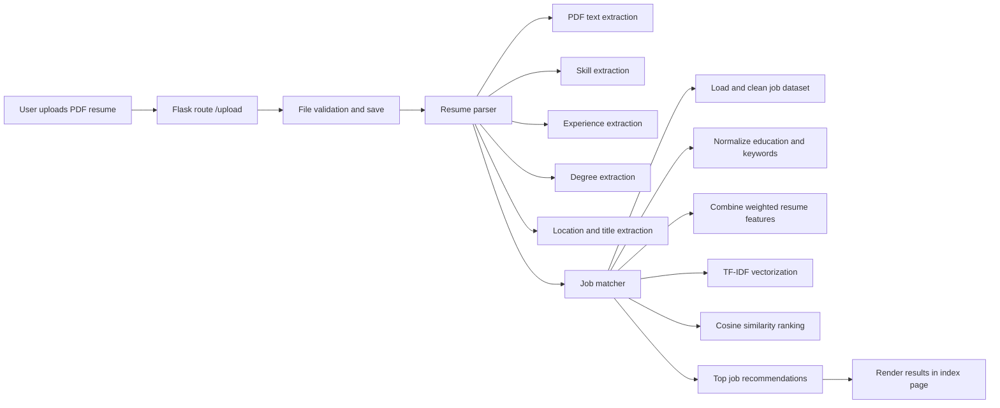

# Job Recommendation System

AI-powered web application that parses a PDF resume and recommends top matching jobs using NLP and TF-IDF based similarity scoring.

## Overview

This project helps job seekers quickly identify relevant opportunities by matching resume content against a structured job dataset.

Core capabilities:

- Resume parsing from PDF files.
- Skill, title, experience, degree, and location extraction.
- Weighted feature composition for better ranking quality.
- Top-N job recommendation from dataset.
- Flask UI with upload validation and dark mode.
- Developer profile page with live GitHub API data.

## Why This Project

Manual job search is time-consuming and inconsistent. This system automates the matching process so users can prioritize the most relevant opportunities faster.

## Key Project Facts

- Jobs in dataset: 321
- Skills keywords: 304
- Title mappings/synonyms: 143
- Degree keywords: 42
- Max upload size: 10 MB
- Allowed upload type: PDF only
- Default recommendations returned: 5

## Tech Stack

### Frontend

- HTML5
- CSS3
- JavaScript

### Backend

- Python 3.8+
- Flask 3.1.0
- pandas 2.2.3
- NumPy 1.26.4
- scikit-learn 1.6.1

### NLP and PDF Processing

- spaCy 3.7.2 with `en_core_web_sm`
- PyMuPDF 1.25.5

### Supporting Libraries

- Werkzeug 3.1.3
- python-dotenv 1.0.0
- requests 2.32.3

## System Architecture



## How It Works

1. User uploads a resume PDF from the home page.
2. Backend validates file type and file size.
3. Resume text is extracted using PyMuPDF.
4. Resume features are extracted:
   - Skills
   - Experience patterns
   - Degrees
   - Locations
   - Job titles
5. Job dataset is loaded and cleaned.
6. Job-side education is normalized with the same degree extractor logic.
7. Resume features are combined with configurable weights.
8. Job text and resume text are vectorized using TF-IDF (1-3 grams).
9. Cosine similarity scores are computed.
10. Top matches are returned and rendered in the UI.

## Feature Details

### Resume Parsing

- PDF text extraction via PyMuPDF.
- NLP preprocessing via spaCy (`en_core_web_sm`).
- N-gram based skill matching (unigram, bigram, trigram).
- Regex-based experience extraction.
- NER-based location extraction (`GPE`, `LOC`, `FAC`).
- Title normalization through synonym mapping.

### Job Matching Logic

Matching uses weighted resume fields from `Config.FEATURE_WEIGHTS`:

- titles: 10
- skills: 9
- experience: 3
- degrees: 3
- location: 2

Then:

- Dataset text is preprocessed.
- TF-IDF vectorizer uses `ngram_range=(1, 3)`, `min_df=1`, `max_df=0.9`.
- Cosine similarity ranks jobs.
- Top N jobs are returned (default: 5).

### Interface Features

- Resume upload validation.
- Live filename feedback.
- Dark/light theme toggle.
- Developer info page with GitHub API data.

## Installation

### Prerequisites

- Python 3.8+
- pip

### Setup Steps

1. Clone repository.

```bash
git clone https://github.com/avishek-sarkar/Job-Recommendation-System.git
cd Job-Recommendation-System
```

2. Create and activate virtual environment.

```bash
# Windows PowerShell
python -m venv venv
venv\Scripts\Activate.ps1

# macOS/Linux
python3 -m venv venv
source venv/bin/activate
```

3. Install dependencies.

```bash
pip install -r requirements.txt
```

4. Ensure spaCy model is available.

```bash
python -m spacy download en_core_web_sm
```

5. Optional environment file.

```bash
copy .env.example .env
```

### Configuration

Environment variables (`.env`):

- `SECRET_KEY`
- `DEBUG`

Main app configuration (`config.py`):

- `UPLOAD_FOLDER`
- `MAX_CONTENT_LENGTH`
- `ALLOWED_EXTENSIONS`
- `DATASET_PATH`
- `TOP_N_MATCHES`
- `FEATURE_WEIGHTS`

## Project Structure

```text
Job-Recommendation-System/
|-- app.py
|-- config.py
|-- requirements.txt
|-- .env.example
|-- LICENSE
|-- README.md
|-- resources/
|   |-- job_dataset.csv
|   |-- skills.txt
|   |-- job_titles.txt
|   |-- degree_keywords.txt
|   `-- uploads/
|-- static/
|   |-- css/
|   |   `-- style.css
|   `-- js/
|       `-- script.js
|-- templates/
|   |-- index.html
|   `-- developerinfo.html
`-- utilities/
    |-- __init__.py
    |-- common.py
    |-- resume_parser.py
    `-- job_matcher.py
```

## Limitations and Future Improvements

### Current Limitation

The recommendation engine is complete for dataset-based matching. However, the dataset is static and can become outdated.

### Future Improvements

- Automated dataset updater using crawler or official APIs.
- Scheduled refresh pipeline for new jobs.
- Database-backed storage instead of CSV.
- Better filtering for salary, remote work, and role type.
- Candidate profile history and saved jobs.
- Email alerts for relevant new openings.

This is the highest-value collaboration area for contributors.

## License

This project is licensed under the MIT License. See the `LICENSE` file for details.

## Collaboration

Contributions are welcome, especially for:

- Job crawler/API ingestion pipeline.
- Data cleaning and deduplication automation.
- Replacing CSV with production-grade database.
- Test coverage and CI improvements.

If you contribute meaningfully, proper credit will be provided.

## Developer Info

- Avishek Sarkar: https://github.com/avishek-sarkar
- Prantic Paul: https://github.com/prantic007
- In-app developer page: `http://127.0.0.1:5000/developerinfo`

## Contact

- Email: avishek1416@gmail.com
- GitHub issues: https://github.com/avishek-sarkar/Job-Recommendation-System/issues
