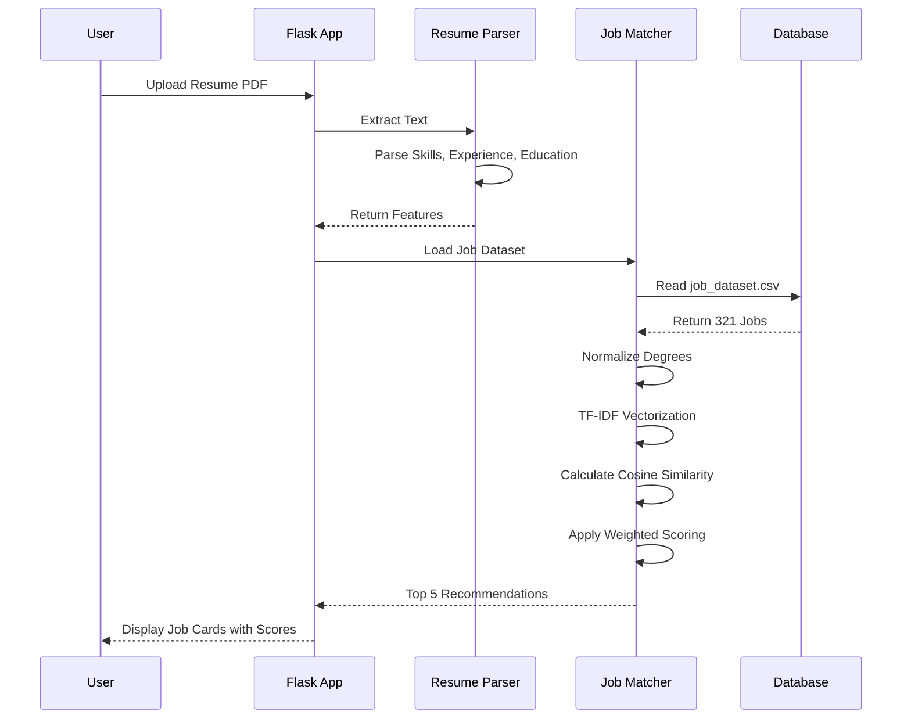

<div align="center">

# 🎯 Job Recommendation System


[](https://www.python.org/)
[](https://flask.palletsprojects.com/)
[](https://scikit-learn.org/)
[](LICENSE)

<p align="center">
  
</p>

**An intelligent job matching system that analyzes your resume and recommends the most suitable jobs using advanced NLP and Machine Learning techniques.**

[Features](#-features) • [Demo](#-demo) • [Installation](#-installation) • [Usage](#-usage) • [Technology Stack](#-technology-stack) • [Collaboration](#-collaboration-opportunity)

---

</div>

## 📋 Table of Contents

- [Overview](#-overview)
- [Features](#-features)
- [Demo](#-demo)
- [How It Works](#-how-it-works)
- [Technology Stack](#-technology-stack)
- [File Structure](#-file-structure)
- [Installation](#-installation)
- [Usage](#-usage)
- [Configuration](#-configuration)
- [Collaboration Opportunity](#-collaboration-opportunity)
- [Developers](#-developers)
- [Contact](#-contact)
- [License](#-license)

---

## 🌟 Overview

<div align="center">
  
</div>

The **Job Recommendation System** is a cutting-edge web application that leverages Natural Language Processing (NLP) and Machine Learning to match job seekers with their ideal positions. By analyzing resume content and comparing it against a comprehensive job database, the system provides personalized job recommendations with similarity scores.

### 🎯 Key Highlights

- 🤖 **AI-Powered Matching**: Uses TF-IDF vectorization and cosine similarity for intelligent job matching
- 📄 **Smart Resume Parsing**: Extracts skills, experience, education, location, and job titles from PDF resumes
- 🎓 **Degree Normalization**: Recognizes and standardizes various degree formats (B.Sc, Bachelor, M.Tech, etc.)
- 🌓 **Modern UI/UX**: Clean, responsive interface with dark mode support
- ⚡ **Real-Time Processing**: Instant job recommendations upon resume upload
- 📊 **Weighted Scoring**: Prioritizes job titles, skills, and experience for accurate matching

---

## ✨ Features

<table>
<tr>
<td width="50%">

### 🔍 Intelligent Resume Analysis
- PDF text extraction using PyMuPDF
- Named Entity Recognition (NER) with spaCy
- Skill extraction from custom keyword database
- Experience level detection (years)
- Location identification
- Degree qualification extraction

</td>
<td width="50%">

### 🎯 Advanced Job Matching
- TF-IDF feature vectorization
- Cosine similarity calculation
- Multi-factor weighted scoring:
  - Job Titles (10x)
  - Skills (9x)
  - Experience (3x)
  - Education (3x)
  - Location (2x)

</td>
</tr>
<tr>
<td width="50%">

### 💻 Modern Web Interface
- Responsive design for all devices
- Dark/Light theme toggle
- File upload with validation
- Real-time feedback
- Developer information page with GitHub integration

</td>
<td width="50%">

### 🔧 Technical Excellence
- Modular code architecture
- Type hints for better code quality
- Error handling and validation
- Efficient resource management
- RESTful API design

</td>
</tr>
</table>

---

## 🎬 Demo

<div align="center">

### 📤 Upload Resume → 🔄 AI Analysis → 🎯 Get Recommendations


</div>

---

## 🔄 How It Works

<div align="center">



</div>

### 📊 Workflow Steps

1. **📄 Resume Upload**: User uploads a PDF resume through the web interface
2. **🔍 Text Extraction**: PyMuPDF extracts text content from the PDF
3. **🧩 Feature Parsing**: 
   - Extract skills using keyword matching
   - Identify job titles from predefined list
   - Calculate experience years using regex
   - Extract education qualifications
   - Identify location using NER
4. **🔄 Data Preprocessing**: 
   - Text normalization and lemmatization with spaCy
   - Degree standardization (B.Sc → bachelor, M.Tech → master)
   - Combine features with weighted importance
5. **📊 Job Dataset Processing**:
   - Load 321 jobs from CSV database
   - Normalize job education requirements
   - Preprocess job descriptions
6. **🎯 Similarity Calculation**:
   - TF-IDF vectorization of resume and job features
   - Calculate cosine similarity scores
   - Apply weighted factors (titles: 10x, skills: 9x, etc.)
7. **📋 Ranking & Display**: Show top 5 most similar jobs

---

## 🛠️ Technology Stack

<div align="center">

### Backend Technologies

[](https://www.python.org/)
[](https://flask.palletsprojects.com/)
[](https://pandas.pydata.org/)
[](https://numpy.org/)
[](https://scikit-learn.org/)

### NLP & Machine Learning

[](https://spacy.io/)
[](https://pymupdf.readthedocs.io/)

### Frontend Technologies

[](https://developer.mozilla.org/en-US/docs/Web/HTML)
[](https://developer.mozilla.org/en-US/docs/Web/CSS)
[](https://developer.mozilla.org/en-US/docs/Web/JavaScript)

</div>

### 📦 Core Libraries

| Library | Version | Purpose |
|---------|---------|---------|
| **Flask** | 2.0+ | Web framework for building the application |
| **spaCy** | 3.0+ | Advanced NLP processing and NER |
| **scikit-learn** | 1.0+ | TF-IDF vectorization and cosine similarity |
| **pandas** | 1.3+ | Data manipulation and CSV handling |
| **PyMuPDF (fitz)** | 1.18+ | PDF text extraction |
| **Werkzeug** | 2.0+ | WSGI utilities and file handling |

### 🧠 Machine Learning Techniques

- **TF-IDF (Term Frequency-Inverse Document Frequency)**: Converts text into numerical vectors
- **Cosine Similarity**: Measures similarity between resume and job vectors
- **Named Entity Recognition (NER)**: Identifies locations and organizations
- **Lemmatization**: Reduces words to base forms for better matching
- **Feature Engineering**: Weighted combination of multiple features

---

## 📁 File Structure

```
Job-Recommendation-System/
│
├── 📄 app.py                          # Main Flask application
├── 📄 config.py                       # Configuration settings
├── 📄 requirements.txt                # Python dependencies
├── 📄 README.md                       # Project documentation
│
├── 📂 utilities/                      # Core utilities package
│   ├── 📄 __init__.py                 # Package initialization
│   ├── 📄 common.py                   # Shared utility functions
│   ├── 📄 resume_parser.py            # Resume parsing logic
│   └── 📄 job_matcher.py              # Job matching algorithm
│
├── 📂 resources/                      # Data files and resources
│   ├── 📄 job_dataset.csv             # Job database (321 jobs)
│   ├── 📄 skills.txt                  # Programming skills list
│   ├── 📄 job_titles.txt              # Job title keywords
│   ├── 📄 degree_keywords.txt         # Education qualifications
│   └── 📂 uploads/                    # Temporary resume uploads
│
├── 📂 templates/                      # HTML templates
│   ├── 📄 index.html                  # Main page
│   └── 📄 developerinfo.html          # Developer info page
│
└── 📂 static/                         # Static assets
    ├── 📂 css/
    │   └── 📄 style.css               # Stylesheet with dark mode
    └── 📂 js/
        └── 📄 script.js               # Client-side JavaScript

```

### 📝 Key Files Description

- **`app.py`**: Flask routes, file upload handling, error management
- **`utilities/resume_parser.py`**: PDF parsing, skill extraction, NER processing
- **`utilities/job_matcher.py`**: Dataset loading, degree normalization, similarity calculation
- **`utilities/common.py`**: Shared functions (degree extraction, text preprocessing)
- **`config.py`**: Application configuration (upload folder, allowed extensions, max file size)
- **`resources/job_dataset.csv`**: Contains 321 jobs with titles, descriptions, requirements, locations

---

## 🚀 Installation

### Prerequisites

- Python 3.8 or higher
- pip package manager
- Virtual environment (recommended)

### Step-by-Step Setup

1️⃣ **Clone the Repository**

```bash
git clone https://github.com/avishek-sarkar/Job-Recommendation-System.git
cd Job-Recommendation-System
```

2️⃣ **Create Virtual Environment**

```bash
# Windows
python -m venv venv
venv\Scripts\activate

# macOS/Linux
python3 -m venv venv
source venv/bin/activate
```

3️⃣ **Install Dependencies**

```bash
pip install -r requirements.txt
```

4️⃣ **Download spaCy Language Model**

```bash
python -m spacy download en_core_web_sm
```

5️⃣ **Verify Installation**

```bash
python -c "import spacy; import sklearn; import fitz; print('✅ All dependencies installed!')"
```

---

## 🎮 Usage

### Running the Application

1️⃣ **Start the Flask Server**

```bash
python app.py
```

2️⃣ **Open Your Browser**

Navigate to: `http://127.0.0.1:5000`

3️⃣ **Upload Resume**

- Click "Choose PDF File" button
- Select your resume (PDF format, max 10 MB)
- Click "Get Job Recommendations"

4️⃣ **View Results**

- Top 5 recommended jobs displayed with similarity scores
- Click "View Details" to see full job descriptions

### 🖼️ Using the Interface

```
┌─────────────────────────────────────────┐
│  🎯 Job Recommendation System           │
│  AI-powered career matching             │
│                                         │
│  [🌙/🌞] ← Theme Toggle                 │
│                                         │
│  ┌─────────────────────────────────┐   │
│  │  📄 Choose PDF File            │   │
│  └─────────────────────────────────┘   │
│                                         │
│  [🚀 Get Job Recommendations]          │
│                                         │
│  ─────────── Results ───────────       │
│                                         │
│  💼 Software Engineer                   │
│  📍 San Francisco, CA                   │
│  [View Details]                         │
│                                         │
└─────────────────────────────────────────┘
```

---

## ⚙️ Configuration

### Customizing the System

**📁 Upload Settings** (`config.py`)

```python
UPLOAD_FOLDER = 'resources/uploads'  # Upload directory
ALLOWED_EXTENSIONS = {'pdf'}          # Allowed file types
MAX_FILE_SIZE = 10 * 1024 * 1024     # 10 MB limit
```

**🎯 Matching Weights** (`utilities/job_matcher.py`)

```python
weighted_resume = (
    titles_resume * 10 +      # Job titles (highest priority)
    skills_resume * 9 +        # Skills
    experience_resume * 3 +    # Experience
    degrees_resume * 3 +       # Education
    location_resume * 2        # Location
)
```

**📚 Resource Files**

- `skills.txt`: Add new programming languages/frameworks
- `job_titles.txt`: Add new job title keywords
- `degree_keywords.txt`: Add new degree abbreviations
- `job_dataset.csv`: Update with new job postings

---

## 🤝 Collaboration Opportunity

<div align="center">
  
  
  ### 🚨 We Need Your Help! 🚨
</div>

### 🔍 The Challenge

The **Job Recommendation System** is **feature-complete** and fully functional for matching resumes with job postings. However, we're currently using a **static dataset** from **early 2025** containing 321 jobs. This dataset is significantly **outdated** and doesn't reflect the current job market.

### 🎯 What We Need

We're looking for contributors to build a **Job Dataset Updater** system that can:

- 🕷️ **Web Crawler/Scraper**: Automatically fetch job postings from popular job boards
  - LinkedIn Jobs
  - Indeed
  - Glassdoor
  - Monster
  - SimplyHired
- 🔄 **Automated Updates**: Schedule periodic updates (daily/weekly)
- 🧹 **Data Cleaning**: Standardize job data format to match our CSV schema
- 📊 **Data Validation**: Ensure data quality and remove duplicates
- 💾 **Database Integration**: Replace CSV with a scalable database (PostgreSQL/MongoDB)
- 🔌 **API Integration**: Use official APIs where available (respecting terms of service)

### 🚫 Why We Couldn't Build It

Due to various **limitations**, we were unable to implement the dataset updater:

- ⚖️ **Legal Concerns**: Web scraping terms of service restrictions
- 💰 **API Costs**: Premium API access for job boards
- ⏰ **Time Constraints**: Development timeline limitations
- 🛠️ **Technical Complexity**: Anti-scraping measures and rate limiting

### 🌟 How You Can Contribute

We welcome developers, data engineers, and enthusiasts who are interested in:

1. 🤖 **Building Web Scrapers**: Using BeautifulSoup, Scrapy, or Selenium
2. 🔌 **API Integration**: Implementing official job board APIs
3. 📊 **Data Engineering**: ETL pipelines and data transformation
4. 🗄️ **Database Design**: Migrating from CSV to scalable databases
5. ☁️ **Cloud Deployment**: Setting up automated jobs on AWS/Azure/GCP

### 🎁 What You'll Get

- ✨ **Full Credit**: Your name featured prominently in the project
- 🏆 **Recognition**: Listed as a key contributor in README and documentation
- 📚 **Learning Opportunity**: Gain experience in web scraping, APIs, and data engineering
- 🤝 **Collaboration**: Work with experienced developers
- 💼 **Portfolio Project**: Showcase your contribution on GitHub and resume

### 📋 Contribution Guidelines

1. Fork the repository
2. Create a new branch: `git checkout -b feature/dataset-updater`
3. Implement your changes with proper documentation
4. Add tests and ensure existing tests pass
5. Submit a pull request with detailed description
6. We'll review and provide feedback

### 💡 Suggested Approaches

```python
# Example: Job Scraper Architecture
class JobDataUpdater:
    def __init__(self):
        self.sources = ['linkedin', 'indeed', 'glassdoor']
        self.db = Database()
    
    def scrape_jobs(self, source):
        """Scrape jobs from specified source"""
        pass
    
    def clean_data(self, raw_data):
        """Standardize and validate job data"""
        pass
    
    def update_database(self, cleaned_data):
        """Update job database with new postings"""
        pass
    
    def schedule_updates(self):
        """Run automated updates periodically"""
        pass
```

<div align="center">

### 🚀 Ready to Contribute?

**Contact us or open an issue to discuss your ideas!**

[](https://github.com/avishek-sarkar/Job-Recommendation-System/issues)
[](mailto:avishek1416@gmail.com)

</div>

---

## 👥 Developers

<div align="center">

### 🎨 Meet the Team

<table>
<tr>
<td align="center" width="50%">
<a href="https://github.com/avishek-sarkar">
<br>
</a>
<b>Avishek Sarkar</b><br>
<i>Developer</i><br><br>
<a href="https://github.com/avishek-sarkar">

</a>
</td>
<td align="center" width="50%">
<a href="https://github.com/prantic007">
<br>
</a>
<b>Prantic Paul</b><br>
<i>Developer</i><br><br>
<a href="https://github.com/prantic007">

</a>
</td>
</tr>
</table>


### 🌐 View Full Developer Profiles

Visit our [Developer Info Page](http://127.0.0.1:5000/developerinfo) to see real-time GitHub statistics and profiles!

</div>

---

## 📞 Contact

<div align="center">

### 💬 Get in Touch

We'd love to hear from you! Whether you have questions, suggestions, or want to collaborate.

<table>
<tr>
<td align="center">
<br>
<b>Email</b><br>
<a href="mailto:avishek1416@gmail.com">avishek1416@gmail.com</a>
</td>
<td align="center">
<br>
<b>GitHub</b><br>
<a href="https://github.com/avishek-sarkar">@avishek-sarkar</a>
</td>
<td align="center">
<br>
<b>Discord</b><br>
<a href="https://github.com/avishek-sarkar/Job-Recommendation-System/discussions">Join Discussion</a>
</td>
</tr>
</table>

### 📬 Project Links

[](https://github.com/avishek-sarkar/Job-Recommendation-System)
[](README.md)
[](https://github.com/avishek-sarkar/Job-Recommendation-System/issues)
[](https://github.com/avishek-sarkar/Job-Recommendation-System/pulls)

</div>

---

## 📄 License

<div align="center">

This project is licensed under the **MIT License** - see the [LICENSE](LICENSE) file for details.

```
MIT License

Copyright (c) 2025 Avishek Sarkar & Prantic Paul

Permission is hereby granted, free of charge, to any person obtaining a copy
of this software and associated documentation files (the "Software"), to deal
in the Software without restriction, including without limitation the rights
to use, copy, modify, merge, publish, distribute, sublicense, and/or sell
copies of the Software, and to permit persons to whom the Software is
furnished to do so, subject to the following conditions:

The above copyright notice and this permission notice shall be included in all
copies or substantial portions of the Software.

THE SOFTWARE IS PROVIDED "AS IS", WITHOUT WARRANTY OF ANY KIND, EXPRESS OR
IMPLIED, INCLUDING BUT NOT LIMITED TO THE WARRANTIES OF MERCHANTABILITY,
FITNESS FOR A PARTICULAR PURPOSE AND NONINFRINGEMENT.
```

</div>

---

## 🙏 Acknowledgments

<div align="center">

Special thanks to:

- 🌟 **spaCy Team** for the amazing NLP library
- 🔬 **scikit-learn Contributors** for machine learning tools
- 🐍 **Python Community** for excellent documentation

</div>

---

## 📊 Project Stats

<div align="center">


### ⭐ If you find this project helpful, please give it a star!


**Made with ❤️ by Avishek Sarkar & Prantic Paul**

</div>
